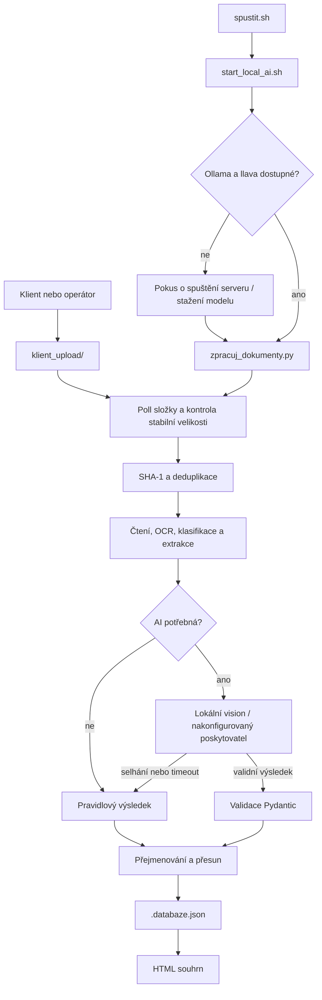

# Technická architektura

## 1. Rozsah a cíle

Aplikace je lokální dávkový/watch-folder procesor dokumentů k pojistným událostem. Sleduje `klient_upload/`, pro každý soubor získá text, klasifikuje typ, vytěží údaje, přesune jej do `roztridene/<kategorie>/` a obnoví HTML souhrn.

Návrh je záměrně jednoduchý: žádná databázová služba, fronta úloh ani webové API. Stav se ukládá do `roztridene/.databaze.json`; jednotlivé soubory zůstávají běžnými soubory na disku. Základním principem je pravidlové zpracování s volitelným AI doplněním, nikoli povinné volání modelu pro každý dokument.

## 2. Komponenty

| Komponenta | Odpovědnost |
|---|---|
| [spustit.sh](spustit.sh) | Tenký vstupní bod; předá řízení lokálnímu launcheru. |
| [start_local_ai.sh](start_local_ai.sh) | Vytvoří log běhu, získá exkluzivní zámek projektu, ověří Ollamu a model, následně spustí Python proces. |
| [zpracuj_dokumenty.py](zpracuj_dokumenty.py) | Polling, čtení/OCR, klasifikace, extrakce, deduplikace, ukládání, přejmenování a HTML report. |
| [ai_vytezeni.py](ai_vytezeni.py) | Datové modely Pydantic, konfigurace poskytovatele, Anthropic klient a lokální OpenAI-kompatibilní/Ollama klient. |
| `klient_upload/` | Příchozí soubory; po úspěšném zpracování se obsah přesune do výstupu. |
| `roztridene/` | Kategorie dokumentů, `.databaze.json` a `SOUHRN_pojistne_udalosti.html`. |
| `logs/` | Samostatný konzolový log pro každý start; výstup současně zůstává v terminálu. |
| [tests/test_zpracuj_dokumenty.py](tests/test_zpracuj_dokumenty.py) | Unit/regresní testy čtení, pravidel, názvů, fallbacku a deduplikace. |

## 3. Runtime a řízení souběhu

`start_local_ai.sh` drží neblokující `flock` v souboru `/tmp/pojistne-udalosti-<hash-cesty>.lock`. Stejný zámek používá `vycistit.sh`, takže výstup nelze vymazat pod běžícím watcherem. Normální režim kontroluje inbox přibližně každou sekundu; `--jednou` projde aktuální soubory a skončí. `ready_files()` porovnává velikost před a po sekundové pauze, aby nezačal číst soubor kopírovaný do inboxu.

## 4. Čtení a OCR

`read_text(path)` dispatchuje podle přípony:

- PDF: `read_pdf()` zkusí textovou vrstvu přes `pypdf`. Pokud je textu málo, renderuje stránky pomocí `pdftoppm` a předá je OCR.
- JPG/PNG/TIFF/BMP/WEBP: `ocr_image()` používá RapidOCR. Odhadne řádky z OCR bounding-boxů a vrátí text.
- DOCX: `read_docx()` čte odstavce a tabulky.
- XLSX/XLSM: `read_xlsx()` čte listy a umí dopočítat podporovaný tvar jednoduchého `SUM` vzorce.
- EML: `read_eml()` extrahuje hlavičky a textové/HTML tělo.
- HTML/TXT/CSV/MD: převod HTML na text, případně přímé čtení textu.

OCR řeší znaky na obrázku, ne význam scény. Prázdný OCR výsledek u fotografie auta je očekávaný a posílá fotografii do kategorie `foto`.

## 5. Klasifikace a extrakce

`classify(text, is_image)` odstraní diakritiku a mezery pomocí `compact()`, sečte vážené indikátory definované v `TYPES` a vrátí typ s nejvyšším skóre. Pro obrázek s malým množstvím rozpoznaných znaků použije prahové pravidlo: signál dokumentu vede ke klasifikaci dokumentu; bez něj se obrázek považuje za fotku. Slabý textový signál vrací `neznamy`.

`extract(type, text, filename)` používá typově specifická regexová pravidla. Společná extrakce dohledává SPZ, VIN a číslo události. `rule_fakta()` převádí výsledek do společné struktury `Fakta`; `rule_naklad()` do struktury nákladu. Report proto nemusí znát všechny původní názvy polí z dokumentu.

`FOLDER` a `TYPE_LABEL` jsou mapy typu dokumentu na fyzickou výstupní složku a český popisek. Přidání nové kategorie vyžaduje sladit typy, mapu složek/popisků, klasifikaci nebo AI schéma, extrakci, případně pravidla reportu a testy.

## 6. AI směrování a kontrakty

AI datové kontrakty jsou modely Pydantic `Analyza`, `Fakta`, `Naklad` a `Udaj` v `ai_vytezeni.py`. Anthropic cesta používá strukturované parsování modelu. Lokální klient posílá požadavky na OpenAI-kompatibilní endpoint Ollamy.

V lokálním režimu `Zpracovani.process()` nejdřív přečte dokument a spustí pravidlovou klasifikaci. Pokud pravidla určí známý typ dokumentu, AI se přeskočí. Lokální AI se použije pro nejednoznačný dokument (`neznamy`) nebo fotografii (`foto`). Vision větev posílá obrázek jako data URL a žádá krátký textový popis; běžná textová extrakce používá JSON režim a Pydantic validaci.

### Současný limit a doporučené rozšíření

Současná lokální větev není OCR backloop: pokud je fotografie klasifikována jako známý typ, například faktura, AI se přeskočí i v případě, že pravidlová extrakce nenašla částku. U typu `foto`/`neznamy` vision větev vrací popisný text, nikoli `Analyza` JSON. Tím se ztrácí možnost doplnit text, který OCR kvůli stínu nebo rotaci nepřečetlo.

Doporučený další krok je vyvolat vision model pro obrázky také při nízké kvalitě OCR nebo při chybějících kritických polích podle typu dokumentu. Model by měl vracet validovatelnou `Analyza` strukturu se stejnými poli `fakta`, `naklad` a `udaje`; OCR/regex výsledek se zachová a obě sady polí se sloučí po jednotlivých hodnotách. AI má doplnit chybějící údaje, ne přepisovat potvrzené hodnoty. Konflikt zdrojů se uloží jako upozornění pro člověka.

Spouštěcí podmínka má být typově specifická: u faktury chybějící částka nebo měna, u technického průkazu chybějící SPZ/VIN, u protokolu chybějící datum nebo účastníci. Jediný omezený AI pokus stačí; při timeoutu se pokračuje s OCR a označí se chybějící pole. Je potřeba testovat také správné OCR případy, aby AI nezvyšovala falešná upozornění ani náklady/čas u každého souboru.

Výjimka nebo timeout v `analyze_ai()` neukončí dávku: aplikace vypíše důvod a přejde na pravidla/OCR. Vision timeout se neopakuje jako textový požadavek, protože textová větev obrázek nevidí. Lokální model pro fotografii běží na CPU stroji pomalu a jeho popis může mít nízkou jistotu; nejde o autoritativní odborné posouzení.

## 7. Deduplikace, jména a stav

Před zpracováním `run_once()` vypočte SHA-1 obsahu. Pokud stejný otisk existuje v databázi a soubor v `roztridene/` stále existuje, nová kopie se odstraní z inboxu, do původního záznamu se přidá upozornění a nový záznam nevznikne. Pokud databázový záznam existuje, ale jeho archivní soubor chybí, nově nahraný soubor se zpracuje znovu a stale záznam se nahradí. SHA-1 je zde identifikátor shodného obsahu, nikoli bezpečnostní kontrola.

`is_uninformative_filename()` zachytává zjevně náhodné alfanumerické názvy. Jen u nich `descriptive_filename()` sestaví název z typu a extrahovaných faktů. `free_name()` řeší kolizi přidáním číselného sufixu. Originál zůstane v `puvodni_soubor`; nové relativní umístění se uloží jako `cesta`. Smysluplné názvy a nerozpoznané soubory se nepřejmenovávají.

`.databaze.json` je aktuální index a zdroj údajů pro report. Soubory jsou fyzicky přesunuté do kategorií. HTML je odvozený výstup generovaný přes `write_summary()`; lze jej znovu sestavit z databáze.

## 8. Výstup a provozní logy

`case_overview()` skládá fakta napříč dokumenty a kontroly nesrovnalostí. `write_summary()` vypisuje přehled události, kontroly, náklady podle měny, fotodokumentaci a karty jednotlivých dokumentů. Původní jméno uploadu se zobrazí u dokumentu, pokud došlo k přejmenování.

`start_local_ai.sh` přesměrovává stdout i stderr přes `tee` do `logs/run_<timestamp>_<pid>.log` a při ukončení zaznamená exit code. Ollama server spuštěný launcherem má zvláštní log `/tmp/pojistne-udalosti-ollama.log`. `./vycistit.sh` maže `roztridene/` a obsah inboxu, ale zachovává logy a odmítne běžet při drženém aplikačním zámku.

## 9. Testování a omezení

Testy pokrývají pravidlovou klasifikaci/extrakci, PDF čtení, OCR varianty, přejmenování náhodných názvů, zachování smysluplných názvů, duplicate guard i obnovu chybějící archivní kopie. Fiktivní datové sady generuje [vytvor_testovaci_dokumenty.py](vytvor_testovaci_dokumenty.py); jeho přímé spuštění obnoví hlavní, náročnou a scénářové složky.

Současná implementace je jednoproceseová aplikace pro lokální demo. JSON databáze nemá souběžné transakce ani víceuživatelskou synchronizaci; exkluzivní zámek chrání pouze jednu kopii tohoto projektu na stejném systému. OCR a model mohou chybovat, proto je HTML souhrn pomůcka k revizi, ne automatické rozhodnutí o pojistném plnění.
